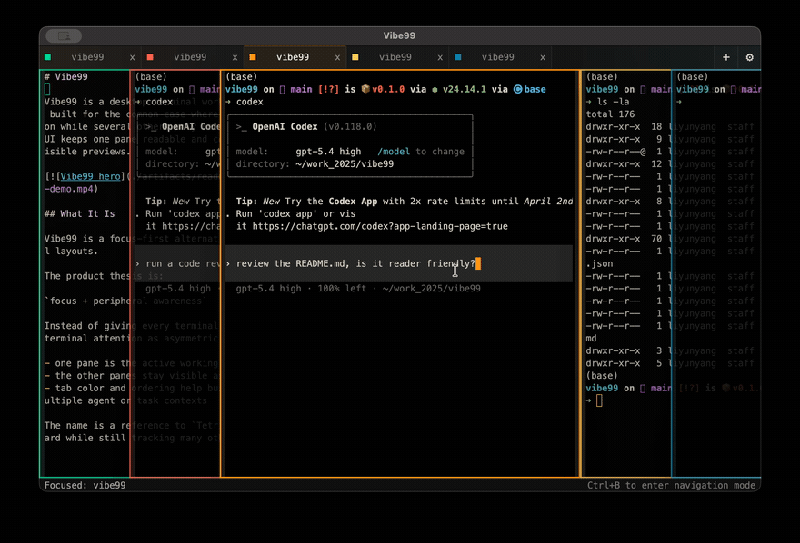

<p align="center">
  
</p>

<h1 align="center">Vibe99</h1>

<p align="center">
  Desktop terminal workspace for agentic coding.
</p>

Vibe99 is a Tauri desktop terminal workspace for agentic coding. It is built for the common case where one terminal needs full attention while several others only need peripheral visibility, so the UI keeps one pane readable and stacks the rest so you can still see what agents are doing.



## Quick Start

Install dependencies and start the Tauri dev app from this repository:

```bash
npm install
npm run tauri:dev
```

`npm run tauri:dev` starts Vite on `http://localhost:1420` and then launches the native Tauri shell. If Cargo is too old, update Rust with:

```bash
rustup update stable
```

Build release artifacts with:

```bash
npm run tauri:build
```

## Basic Controls

- `Cmd+T` on macOS or `Ctrl+T` elsewhere: add a pane
- ``Ctrl+` ``: cycle to the most recently visited pane (hold the modifier and press again to step further back; add `Shift` to cycle forward)
- `Ctrl+B`: enter navigation mode
- `Left` / `Right` or `H` / `L` in navigation mode: move focus
- `Enter` in navigation mode: focus the selected terminal
- double-click a tab: rename it
- drag a tab: reorder panes
- top-right `+`: add pane
- top-right gear: open display settings

## Platform Defaults And Known Issues

- Terminal font defaults are platform-aware: `Consolas` on Windows, `Menlo` on macOS, and `DejaVu Sans Mono` on Linux.
- WSL integration is available on Windows and is a no-op on macOS/Linux.
- Known issue: the native macOS title bar can remain light while the system is in dark mode. See [issue #28](https://github.com/NekoApocalypse/Vibe99/issues/28).

## Stack

- Tauri 2
- Vite
- Rust
- `portable-pty`
- `xterm.js`
- `@xterm/addon-fit`
- `@xterm/addon-web-links`
- `@xterm/addon-webgl`

## Contributing

See [CONTRIBUTING.md](./CONTRIBUTING.md).
